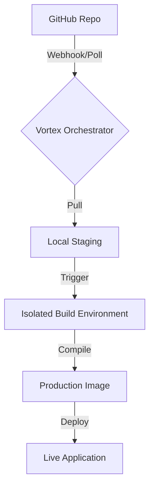

<div align="center">

# 🌪️ Vortex-Deploy
### Industrial-Grade Self-Hosted CI/CD Engine
[](https://opensource.org/licenses/MIT)
[](https://nodejs.org/)
[](https://www.docker.com/)
[]()

**Vortex-Deploy** is a sophisticated, self-hosted deployment platform that automates the transition from "Commit" to "Production." It mirrors the core functionality of enterprise tools like Vercel and Netlify, but allows for 100% control on your own infrastructure.

[Architecture](#-system-architecture) • [Feature Matrix](#-feature-matrix) • [Quick Start](#-getting-started)

</div>

---

## 🚀 Feature Matrix

| Engine Component | Functionality | Business Value |
| :--- | :--- | :--- |
| **🔄 Auto-Sync** | Real-time GitHub Webhook polling. | Zero-Touch Deployment |
| **⚙️ Build Orchestrator** | Multi-stage isolation (Audit -> Compile). | Production Stability |
| **📊 Analytics Engine** | Real-time console logs & health metrics. | High Observability |
| **🛡️ Secure Store** | AES-encrypted local deployment vault. | Data Sovereignty |
| **🔌 Universal API** | RESTful endpoints for custom dashboards. | Scalable Architecture |

---

## 📐 System Architecture

<details>
<summary><b>View Infrastructure Workflow</b></summary>

Vortex-Deploy uses a stateless orchestrator that handles code synchronization before triggering an isolated build environment.


</details>

---

## 🛠️ Tech Stack

<div align="center">

| Core | Deployment | Tools |
| :---: | :---: | :---: |
| Node.js / ESM | Simple-Git | Chalk (Logs) |
| Express.js | Docker API | Dotenv |

</div>

---

## 🏃 Getting Started

<details>
<summary><b>Installation Guide</b></summary>

1. **Clone Project**
   ```bash
   git clone https://github.com/kamalesh4044/vortex-deploy.git && cd vortex-deploy
   ```
2. **Setup Dependencies**
   ```bash
   npm install
   ```
3. **Trigger Deployment**
   ```bash
   curl -X POST http://localhost:3000/deploy \
        -H "Content-Type: application/json" \
        -d '{"repoUrl": "YOUR_REPO", "projectName": "my-app"}'
   ```
</details>

---

<div align="center">

### Developed with 🖤 by [Kamal](https://github.com/kamalesh4044)
*Part of the Elite Engineering Series*

</div>
