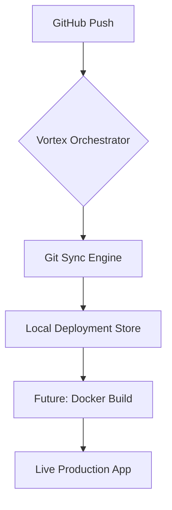

# 🌪️ Vortex-Deploy: Self-Hosted CI/CD Engine

**Vortex-Deploy** is a high-performance, self-hosted deployment platform designed for modern web applications. It automates the transition from "Commit" to "Live" by synchronizing with GitHub and managing local deployments.

---

## 🚀 Core Capabilities

- **🔄 Auto-Sync**: Monitors GitHub repositories and pulls the latest code automatically.
- **🏗️ Build Isolation**: Prepares isolated environments for project builds.
- **📊 Real-time Logs**: Provides color-coded system logs for deployment tracking.
- **🛡️ Secure Orchestration**: Uses industrial-grade Git protocols for code management.
- **🔌 API-First Design**: Easy to integrate with any custom dashboard or frontend.

---

## 🛠️ Tech Stack

- **Backend**: Node.js (ES Modules)
- **Networking**: Express.js
- **Git Engine**: Simple-Git
- **Logging**: Chalk / Custom CLI Output

---

## 📐 Architecture



---

## 🏃 Getting Started

### Prerequisites
- Node.js (v20+)
- Git installed on the host machine

### Installation
1. Clone the repository:
   ```bash
   git clone https://github.com/your-username/vortex-deploy.git
   cd vortex-deploy
   ```
2. Install dependencies:
   ```bash
   npm install
   ```

### Triggering a Deployment
Send a POST request to the `/deploy` endpoint:

```bash
curl -X POST http://localhost:3000/deploy \
     -H "Content-Type: application/json" \
     -d '{"repoUrl": "https://github.com/user/repo.git", "projectName": "my-app"}'
```

---

## 👤 Author
**Kamal** - *DevOps & Systems Engineer*
